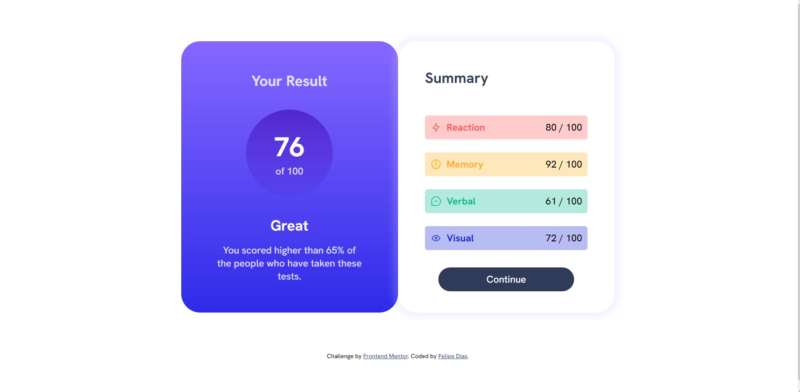

# Frontend Mentor - Results summary component solution
# WORK IN PROGRESS

This is a solution to the [Results summary component challenge on Frontend Mentor](https://www.frontendmentor.io/challenges/results-summary-component-CE_K6s0maV). Frontend Mentor challenges help you improve your coding skills by building realistic projects. 

## Table of contents

- [Overview](#overview)
  - [The challenge](#the-challenge)
  - [Screenshot](#screenshot)
  - [Links](#links)
- [My process](#my-process)
  - [Built with](#built-with)
  - [What I learned](#what-i-learned)
  - [Continued development](#continued-development)
  - [Useful resources](#useful-resources)
- [Author](#author)

## Overview

### The challenge

Users should be able to:

- View the optimal layout for the interface depending on their device's screen size
- See hover and focus states for all interactive elements on the page
- **Bonus**: Use the local JSON data to dynamically populate the content

### Screenshot



### Links

- Solution URL: [Add solution URL here](https://your-solution-url.com)
- Live Site URL: [Add live site URL here](https://your-live-site-url.com)

## My process

### Built with

- Semantic HTML5 markup
- CSS custom properties
- CSS media queries
- Flexbox

### What I learned

In this little project I was able to remind and pratice some basic HTML and CSS functionalities. Also, was good to write and pratice a little bit of javascript, revisiting how you could manipulate the DOM. First time using CSS media query and learning how this feature works towards responsiveness.
One of the things I was having some trouble with, was: "How I would get that json file with the required data to fill in the HTML?". The obvious answer was: "with javascript, of course", but still didn't know how exactly. I stumbled with the fetch method and promisses, and remembered how I could capture that data. Then I upgrade it to an async function and it worked! Maybe I am a little bit rusty on frontend, but it was a good result, personally. 


```js
async function transferDatafromJson() {

  const receivedJson = await fetch("data.json").then(response => response.json())

  const categoriesId = {
    Reaction: "reaction-stat",
    Memory: "memory-stat",
    Verbal: "verbal-stat",
    Visual: "visual-stat",
  }

  for (let i = 0; i < receivedJson.length; i++) {


    let actualCategory = receivedJson[i].category
    let actualScore = receivedJson[i].score
    let actualIcon = receivedJson[i].icon


    document.getElementById(categoriesId[actualCategory]).innerHTML =
      ` <div>
            
            <h4>
              ${actualCategory}
            </h4>

          </div>
          <div>
          ${actualScore} / 100
          </div>
          
        </div>
        `
  }

}
```

### Continued development

On future projects or challenges, I want to keep working not only with bare HTML, CSS and javascript, but with the Angular framework. For now I will stick with the HTML, CSS and javascript to complete these initial challenges, to perceive how the frontend really works and get more used to building frontend applications. 

### Useful resources

- [w3schools](https://www.w3schools.com) - This site helped me for having an imense HTML, CSS and javascript reference and also simple guides to understand what something does and how to use it.
- [developer mozilla org](https://developer.mozilla.org) - The ultimate documentation for web development, helped me a lot to understand how some css properties, html tags and javascript functions really works.

## Author

- LinkedIn - [Felipe Dias](https://www.linkedin.com/in/felipe-dsprado/)
- Frontend Mentor - [FelipeDiasD](https://www.frontendmentor.io/profile/FelipeDiasD)
- Github - [FelipeDiasD](https://github.com/FelipeDiasD)